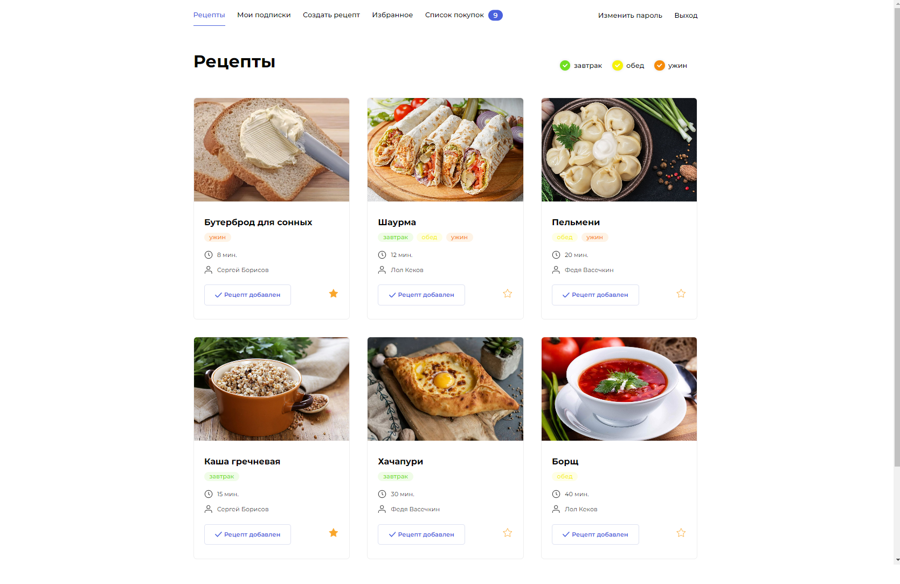

# praktikum_new_diplom


Domen names:
    fudgram.sytes.net
    158.160.71.218

Admin login:
    brsv
Password:
    1234


<!---Результат тестирования-->


***
# Foodgram - Дипломный проект Практикума

## Описание проекта
«Фудграм» — web-приложение, позволяющее своим пользователям делиться любимыми рецептами с другими пользователями, добавлять чужие рецепты в избранное и подписываться на публикации других авторов. Так же реализована возможность скачать список покупок, необходимый для приготовление выбранных рецептов.



### Запуск проекта
Клонируейте репозиторий с проектом:
```bash
git clone https://github.com/BRSV94/foodgram-project-react.git && cd foodgram-project-react
```

Создайте виртуальное окружение

```bash
python -m venv venv
```

Активируйте виртуальное окружение

```bash
source venv/bin/activate
```
или
```bash
source venv/Scripts/activate
```

Установите библиотеки python

```bash
pip install --upgrade pip && pip install -r backend/requirements/requirements.txt
```

Выполните миграцию базы данных

```bash
python backend/manage.py migrate
```

Создайте суперпользователя

```bash
python backend/manage.py createsuperuser
```

Создайте файл c переменными окружения `.env`
```bash
POSTGRES_USER=django_user_example
POSTGRES_PASSWORD=mysupersecretpasswordexample
POSTGRES_DB=foodgram_db

DB_HOST=db
DB_PORT=5432

SECRET_KEY = 'django-insecure-example'
DEBUG = 'True'
ALLOWED_HOSTS = '127.0.0.1, localhost, you.host.name'
```


Установите [docker](https://docs.docker.com/engine/install/)

Перейдите в директорию в файлом [docker-compose.yml](infra/)
Запустите проект:
```bash
docker compose up --build
```


## Стэк технологий

* **Бэкэнд**: Django, DRF, Gunicorn
* **Фронтэнд**: React
* **База данных**: PosgreSQL
* **Статика**: Nginх


## Документация
Документация доступна по ссылке `{your.host.name}/api/docs` после запуска проекта.


## Дипломную работу выполнил
[Сергей Борисов](https://github.com/BRSV94/)
